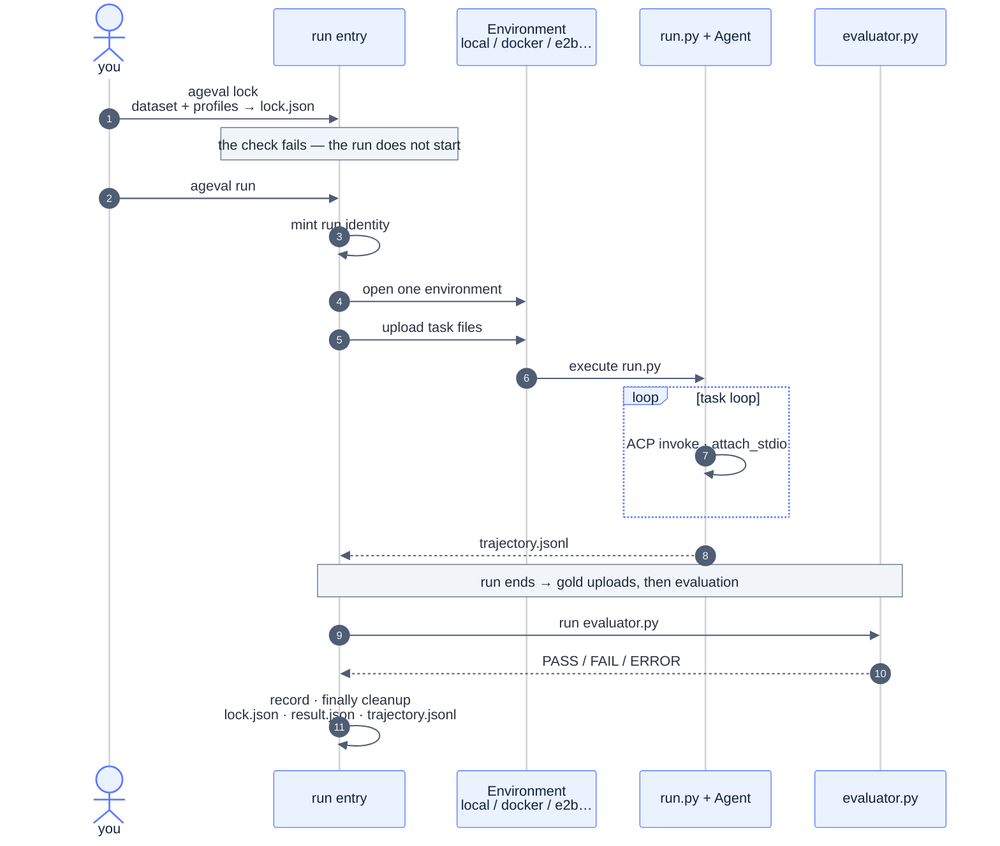

<div align="center"><a name="readme-top"></a>


# ageval

**English** · [简体中文](README.zh-CN.md)

<br/>

<!-- SHIELD GROUP -->

<a href="https://github.com/ZJU-REAL/ageval/stargazers"></a>
<a href="https://github.com/ZJU-REAL/ageval/releases"></a>
<a href="https://github.com/ZJU-REAL/ageval/actions/workflows/ci.yml"></a>
<a href="https://github.com/ZJU-REAL/ageval/blob/main/LICENSE"></a>
<a href="https://zju-real.github.io/ageval/en/docs/"></a>
<a href="#getting-started"></a>
<a href="https://youtu.be/MxiM9A9YvLc"></a>

</div>

<details>
<summary><kbd>Table of contents</kbd></summary>

#### TOC

- [⚡ Getting started](#getting-started)
  - [Install skills](#install-skills)
  - [Develop from source](#develop-from-source)
- [✨ Features](#features)
  - [Screenshots](#screenshots)
- [⚙️ How it works](#how-it-works)
  - [End-to-end flow](#end-to-end-flow)
  - [Core base](#core-base)
  - [Plugins](#plugins)
- [📁 Project structure](#project-structure)
- [📖 Docs](#docs)

<br/>

</details>

How to avoid rewriting scaffolds for the huge set of agent runtime × model × environment combinations?

**ageval** keeps one stable Core and swaps the agent under test and the environment through plugins. Install the CLI and skills so a coding agent can design or convert a benchmark and finish the eval; after results land on the Hub, datasets, plugins, and Agent packages can be shared or reused publicly.

<p align="center">
  <video src="https://github.com/user-attachments/assets/79f54d94-999f-44c1-b2a4-72d79d3ce1f4" controls width="100%" title="ageval highlights"></video>
</p>

## Getting started

```bash
uv tool install ageval-cli
# install everything, or only what you need
uv tool install 'ageval-cli[all]' # everything
uv tool install 'ageval-cli[e2b]' # one extra at a time

ageval -V
```

Run a dataset straight from the Hub, or any local dataset root:

```bash
ageval registry list                        # datasets visible on the Hub
ageval run official/minimal-demo@0.1.3 --task terminal-jsonl-agg
ageval run <org>/<name>@<version> --task <task-id>
ageval executors -v
ageval view <org>/<name>@<version> --no-browser
```

### Install skills

Install skills for your local coding agent (CLI usage, plugins, dataset authoring, and more):

```bash
# install all
npx skills add ZJU-REAL/ageval
# install specific ones
npx skills add ZJU-REAL/ageval --skill ageval-cli
```

### Develop from source

To try the in-repo dataset examples and Agent catalog packs, or to build from source, clone the repo:

```bash
git clone https://github.com/ZJU-REAL/ageval.git
cd ageval
uv sync --frozen --all-packages
uv run ageval -V
```

Run the in-repo minimal example and inspect the results in the local Viewer:

```bash
uv run ageval tasks examples/datasets/minimal-demo
uv run ageval run  examples/datasets/minimal-demo --task terminal-jsonl-agg
uv run ageval view examples/datasets/minimal-demo --no-browser
```

<div align="right">

[![][back-to-top]](#readme-top)

</div>

## Features

**Quickly switch the agent under test**

Environments and agent runtimes both plug in. The default path is [ACP](https://agentclientprotocol.com); [nooa](https://github.com/NVIDIA-NeMo/labs-OO-Agents), [dsh](https://github.com/deepseek-ai/deepseek-harness), and [miniswe](https://github.com/SWE-agent/mini-swe-agent) use the same plugin path. Change one line in `profiles.yaml`, or pass `--agent` for a one-off switch.

**Let the Agent run the eval**

With the CLI and skills installed, a coding agent can author or convert a dataset and run the eval end to end. Afterwards, `ageval view` replays the trajectory locally: phase timing, tool calls, and a reproduce command for failed tasks. See [Getting started](#getting-started).

**Share and reuse on Hub**

Upload datasets, plugins, Agent packages, and results to ageval Hub. Leaderboard scores name the Agent and environment used; pull a published Agent with `--agent`; compare models side by side.

### Screenshots

|                                                        Plugin marketplace                                                         |                                             Compare models on Hub                                             |
| :-------------------------------------------------------------------------------------------------------------------------------: | :-----------------------------------------------------------------------------------------------------------: |
|  |  |

<details>
<summary>More screenshots</summary>
<br/>

<p align="center">nooa plugin: NVIDIA's official agent runtime</p>
<p align="center"></p>

<p align="center">Leaderboard: scores bound to environment and Agent</p>
<p align="center"></p>

<p align="center">Models Hub: success rate and cost by model</p>
<p align="center"></p>

<p align="center">Model detail: one model across datasets and Agents</p>
<p align="center"></p>

</details>

<div align="right">

[![][back-to-top]](#readme-top)

</div>

## How it works

### End-to-end flow

1. **`ageval lock`** resolves the plugin graph (`ExtensionGraph`), checks capabilities and credentials, and writes `lock.json` (secrets stay locators).
2. **`ageval run`** opens an environment and uploads task files (local / Docker / E2B, …).
3. **`run.py`** drives the task loop inside that environment; swapping env or Agent does not require editing this file.
4. **Only `evaluator.py` can return PASS**; gold uploads after the run; cleanup always runs.



### Core base

ageval Core is a fixed five-phase pipeline: `lock → environment → run → evaluate → record`. Inputs are the user, dataset, and profiles; outputs land in evidence (`lock.json`, `result.json`, `trajectory.jsonl`). At `ageval lock`, one environment plugin and one Agent plugin are bound. Before the run starts, `limits` cap wall-clock time, memory, process forks, and call counts; `cleanup` always runs. Swapping an Agent or an environment does not require changing Core.

<p align="center">
  
</p>

### Plugins

Core does not hard-code a particular Agent or environment. Plugins declare what they provide and what capabilities they need; `ageval lock` resolves a dependency graph (`ExtensionGraph`), and later dispatch follows that graph.

```yaml
# Agent plugin (e.g. dsh)
plugin_id: dsh
slots:
  exclusive:
    - id: executor
inject:
  - service: environment
    capabilities: [exec, upload]

# Environment plugin (e.g. docker)
plugin_id: docker
slots:
  exclusive:
    - id: environment
```

<p align="center">
  
</p>

<div align="right">

[![][back-to-top]](#readme-top)

</div>

## Project structure

```text
ageval/
├── src/ageval/
│   ├── cli/                         # argv, help, exit code
│   ├── application/
│   │   ├── composition.py           # sole production wiring; CLI imports build_* here
│   │   ├── lock.py                  # load_and_lock
│   │   ├── run.py                   # mint identity → run_attempt
│   │   ├── campaign.py / suite/     # matrix · suite · Always-k
│   │   └── agent_ops/ / plugin_ops / registry_ops/
│   ├── attempt/                     # Attempt pipeline
│   │   ├── __init__.py              # run_attempt
│   │   └── phases/                  # environment → run → evaluate → record · cleanup
│   ├── config/                      # dataset + task.yaml + profiles
│   ├── environments/protocol.py     # EnvironmentProvider · caps; no vendor SDK
│   ├── plugins/
│   │   ├── slots.py                 # exclusive / chain
│   │   └── contrib/                 # acp · local · docker · e2b · daytona · ssh
│   ├── runtime/                     # identity, parent Agent Service, task_worker
│   ├── evaluation/                  # bind PASS
│   └── evidence/                    # trajectory.jsonl layout
├── src/ageval_sdk/                  # ageval_sdk for run.py (no PASS, no host credentials)
├── plugins/                         # external ageval.plugin/1 (nooa, dsh, miniswe, …)
├── examples/
│   ├── datasets/
│   │   ├── minimal-demo/            # terminal-jsonl-agg · tau2-dialog-min · multiagent-env-min
│   │   └── tau3-airline-5/            # airline-00 … airline-04
│   └── agents/                      # ageval.agent/1
├── apps/viewer                      # ageval view SPA
├── apps/hub                         # Hub SPA
├── services/registry/               # package + results HTTP
├── docker/attempt/                  # official image; ACP entries baked in
├── docs/                            # mechanism design
└── website/                         # product docs
```

<div align="right">

[![][back-to-top]](#readme-top)

</div>

## Docs

- Usage: [docs site](https://zju-real.github.io/ageval/en/docs/) ([source](website/))
- Design: [`docs/`](docs/README.md)
- Examples: [`examples/README.md`](examples/README.md)
- [`AGENTS.md`](AGENTS.md)
- [`ARCHITECTURE.md`](ARCHITECTURE.md)

<div align="right">

[![][back-to-top]](#readme-top)

</div>

<!-- LINK GROUP -->

[back-to-top]: https://img.shields.io/badge/-↑_BACK_TO_TOP-1B54E8?style=flat-square
