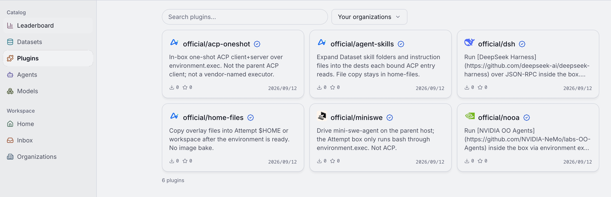
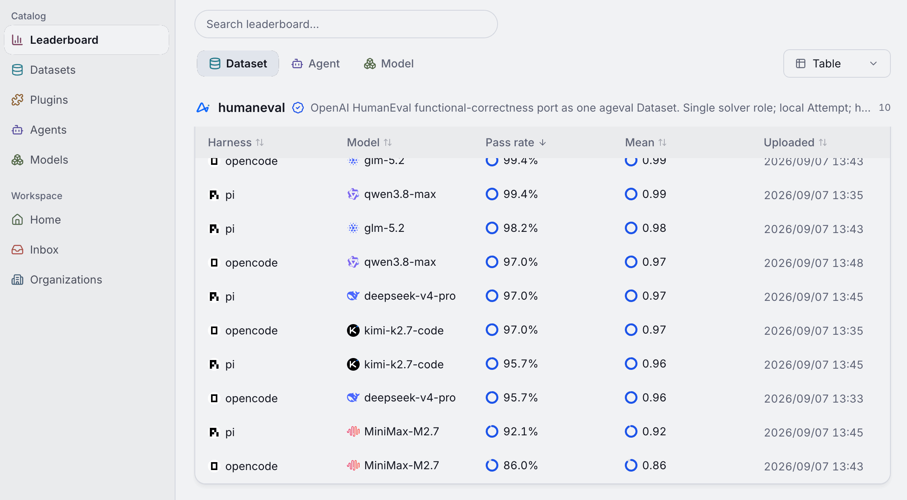
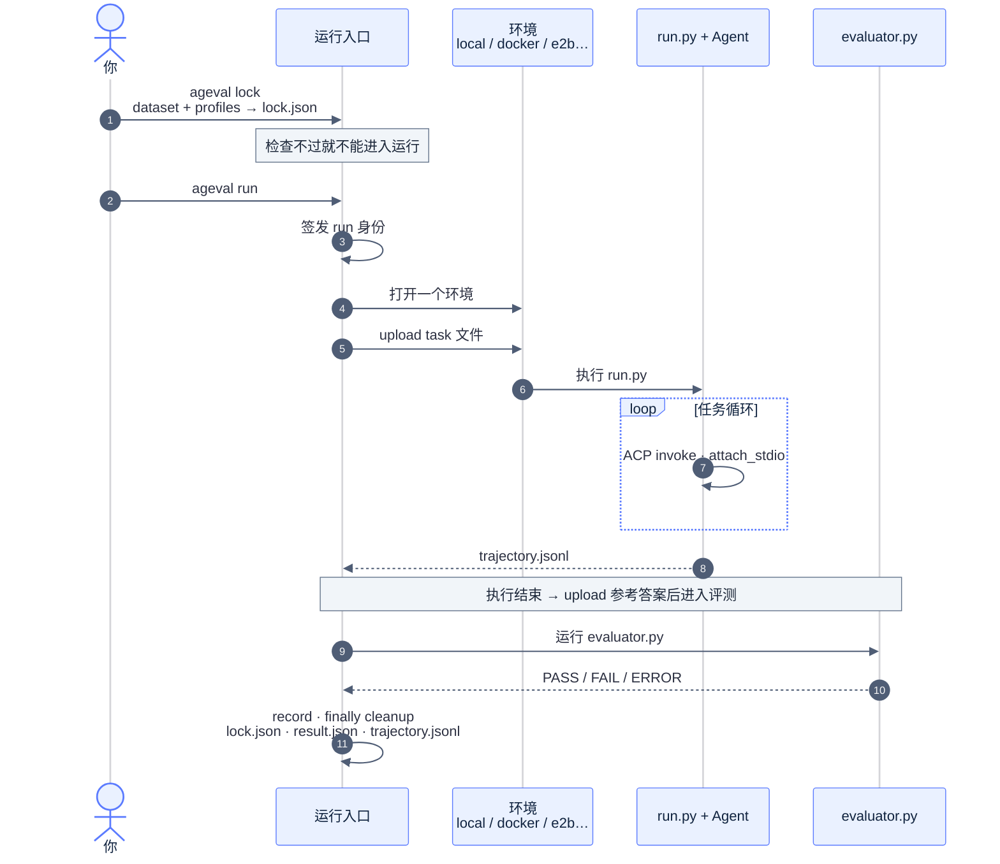

<div align="center"><a name="readme-top"></a>


# ageval

[English](README.md) · **简体中文**

<br/>

<!-- SHIELD GROUP -->

<a href="https://github.com/ZJU-REAL/ageval/stargazers"></a>
<a href="https://github.com/ZJU-REAL/ageval/releases"></a>
<a href="https://github.com/ZJU-REAL/ageval/actions/workflows/ci.yml"></a>
<a href="https://github.com/ZJU-REAL/ageval/blob/main/LICENSE"></a>
<a href="https://zju-real.github.io/ageval/zh-CN/docs/"></a>
<a href="#快速开始"></a>
<a href="https://youtu.be/MxiM9A9YvLc"></a>

</div>

<details>
<summary><kbd>目录</kbd></summary>

#### TOC

- [⚡ 快速开始](#快速开始)
  - [安装 skills](#安装-skills)
  - [从源码开发](#从源码开发)
- [✨ 功能](#功能)
  - [截图](#截图)
- [⚙️ 如何运行](#如何运行)
  - [整体链路](#整体链路)
  - [基座总览](#基座总览)
  - [插件接入](#插件接入)
- [📁 目录结构](#目录结构)
- [📖 文档](#文档)

<br/>

</details>

如何避免为 Agent 运行时、模型与环境的海量组合重复编写脚手架？

**ageval** 用一套稳定的 Core，靠插件切换待测 Agent 和环境。装上 CLI 和 skill，coding agent 可以自己设计或转化 benchmark 并跑完评测；结果上传 Hub 后，dataset、插件和 Agent 包也能公开分享或复用。

<p align="center">
  <video src="https://github.com/user-attachments/assets/79f54d94-999f-44c1-b2a4-72d79d3ce1f4" controls width="100%" title="ageval highlights"></video>
</p>

## 快速开始

```bash
uv tool install ageval-cli
# 装全依赖或者按需安装
uv tool install 'ageval-cli[all]' # 一次装全
uv tool install 'ageval-cli[e2b]' # 按需装单个 extra

ageval -V
```

直接跑 Hub 上的 dataset，或跑任意本地 dataset 根目录：

```bash
ageval registry list                        # 查看 Hub 上可见的 dataset
ageval run official/minimal-demo@0.1.3 --task terminal-jsonl-agg
ageval run <org>/<name>@<version> --task <task-id>
ageval executors -v
ageval view <org>/<name>@<version> --no-browser
```

### 安装 skills

为本机 coding agent 安装 skills（CLI 使用、插件、dataset 编写等）：

```bash
# 安装全部
npx skills add ZJU-REAL/ageval
# 指定安装
npx skills add ZJU-REAL/ageval --skill ageval-cli
```

### 从源码开发

体验仓库内的 dataset 示例以及 Agent 目录包，或需要从源码构建，clone 仓库：

```bash
git clone https://github.com/ZJU-REAL/ageval.git
cd ageval
uv sync --frozen --all-packages
uv run ageval -V
```

运行仓库内最小示例并在本地查看器查看结果：

```bash
uv run ageval tasks examples/datasets/minimal-demo
uv run ageval run  examples/datasets/minimal-demo --task terminal-jsonl-agg
uv run ageval view examples/datasets/minimal-demo --no-browser
```

<div align="right">

[![][back-to-top]](#readme-top)

</div>

## 功能

**快速切换待评测 Agent**

环境和 Agent 运行时都经插件接入。默认走 [ACP](https://agentclientprotocol.com)；[nooa](https://github.com/NVIDIA-NeMo/labs-OO-Agents)、[dsh](https://github.com/deepseek-ai/deepseek-harness)、[miniswe](https://github.com/SWE-agent/mini-swe-agent) 也是同一条插件链路。改 `profiles.yaml` 一行，或用 `--agent` 临时指定即可切换。

**让 Agent 自己跑评测**

装上 CLI 和 skill 后，coding agent 能按规范写或转化 dataset，并端到端跑完。跑完用 `ageval view` 在本地复盘轨迹：各阶段耗时、工具调用，以及失败任务的复现命令。安装见[快速开始](#快速开始)。

**在 Hub 上分享与复用**

把 dataset、插件、Agent 包和评测结果上传到 ageval Hub。榜单上的成绩会标明用的 Agent 和环境；已发布的 Agent 可用 `--agent` 直接拉取；也可以按模型横向对比。

### 截图

|                                                 插件市场                                                  |                                             Hub 上比较模型                                              |
| :-------------------------------------------------------------------------------------------------------: | :-----------------------------------------------------------------------------------------------------: |
|  |  |

<details>
<summary>更多截图</summary>
<br/>

<p align="center">nooa 插件详情：NVIDIA 官方 Agent 运行时</p>
<p align="center"></p>

<p align="center">Leaderboard：不同环境与 Agent 组合下的成绩</p>
<p align="center"></p>

<p align="center">Models Hub：按模型看成功率和成本</p>
<p align="center"></p>

<p align="center">Model 详情：同一模型在不同 dataset 和 Agent 下的表现</p>
<p align="center"></p>

</details>

<div align="right">

[![][back-to-top]](#readme-top)

</div>

## 如何运行

### 整体链路

1. **`ageval lock`** 解析插件依赖图（`ExtensionGraph`），检查能力和凭据，写出 `lock.json`（密钥只当 locator）。
2. **`ageval run`** 打开环境并上传 task 文件（本机 / Docker / E2B 等）。
3. **`run.py`** 在环境里跑任务循环；换环境或换 Agent 不需要修改这份文件。
4. **只有 `evaluator.py` 能给出 PASS**；任务结束后才 upload 参考答案；无论结果如何都会 cleanup。



### 基座总览

ageval Core 是固定的五阶段流水线：`lock → environment → run → evaluate → record`。输入是用户、dataset 和 profiles，输出落到 evidence（`lock.json`、`result.json`、`trajectory.jsonl`）。环境插件和 Agent 插件在 `ageval lock` 时各自绑定一个；开跑前按 `limits` 施加资源上限（墙钟 / 内存 / 进程 / 调用次数），`cleanup` 始终会跑。换 Agent 或换环境，不需要修改 Core。

<p align="center">
  
</p>

### 插件接入

Core 不会写死某个 Agent 或环境。插件声明自己提供什么、需要什么能力；`ageval lock` 解析成依赖图（`ExtensionGraph`），之后按图调度。

```yaml
# Agent 插件（如 dsh）
plugin_id: dsh
slots:
  exclusive:
    - id: executor
inject:
  - service: environment
    capabilities: [exec, upload]

# 环境插件（如 docker）
plugin_id: docker
slots:
  exclusive:
    - id: environment
```

<p align="center">
  
</p>

<div align="right">

[![][back-to-top]](#readme-top)

</div>

## 目录结构

```text
ageval/
├── src/ageval/
│   ├── cli/                         # 参数、帮助、退出码
│   ├── application/
│   │   ├── composition.py           # 生产接线唯一入口；CLI 只 import 此处的 build_*
│   │   ├── lock.py                  # load_and_lock
│   │   ├── run.py                   # 签发身份 → run_attempt
│   │   ├── campaign.py / suite/     # 矩阵 · suite · Always-k
│   │   └── agent_ops/ / plugin_ops / registry_ops/
│   ├── attempt/                     # 一次运行的流水线
│   │   ├── __init__.py              # run_attempt
│   │   └── phases/                  # environment → run → evaluate → record · cleanup
│   ├── config/                      # dataset + task.yaml + profiles
│   ├── environments/protocol.py     # EnvironmentProvider · 能力；不含厂商 SDK
│   ├── plugins/
│   │   ├── slots.py                 # exclusive / chain
│   │   └── contrib/                 # acp · local · docker · e2b · daytona · ssh
│   ├── runtime/                     # 身份、父进程 Agent Service、task_worker
│   ├── evaluation/                  # 绑定 PASS
│   └── evidence/                    # trajectory.jsonl 布局
├── src/ageval_sdk/                  # run.py 用的 ageval_sdk（不判定 PASS，不持有宿主凭据）
├── plugins/                         # 外置 ageval.plugin/1（nooa、dsh、miniswe 等）
├── examples/
│   ├── datasets/
│   │   ├── minimal-demo/            # terminal-jsonl-agg · tau2-dialog-min · multiagent-env-min
│   │   └── tau3-airline-5/            # airline-00 … airline-04
│   └── agents/                      # ageval.agent/1
├── apps/viewer                      # ageval view SPA
├── apps/hub                         # Hub SPA
├── services/registry/               # 包与结果 HTTP
├── docker/attempt/                  # 官方镜像；ACP entry 在 build 期装入
├── docs/                            # 机制设计
└── website/                         # 产品文档
```

<div align="right">

[![][back-to-top]](#readme-top)

</div>

## 文档

- 用法：[文档站](https://zju-real.github.io/ageval/zh-CN/docs/)（[源码](website/)）
- 设计：[docs/](docs/README.md)
- 示例：[examples/README.md](examples/README.md)
- [AGENTS.md](AGENTS.md)
- [ARCHITECTURE.md](ARCHITECTURE.md)

<div align="right">

[![][back-to-top]](#readme-top)

</div>

<!-- LINK GROUP -->

[back-to-top]: https://img.shields.io/badge/-↑_回到顶部-1B54E8?style=flat-square
